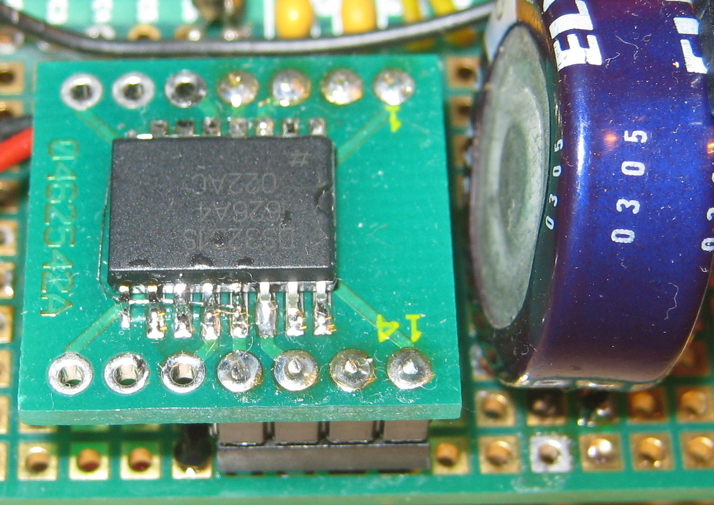

.. _clockworks_rtc_ds3231:

Adding a RTC: DS3231
====================

:Date: 2017-08-19

.. contents::
   :local:
   :depth: 1

Intro
-----

 - the clock provides these counters
   
   - second (0 .. 59)
   - minute (0 .. 59)
   - hour (0 .. 23)
   - 24h / am/pm flags
   - day of week (1 .. 7)
   - day of month (1 .. 28,29,30,31)
   - month (1 .. 12)
   - century rollover flag
   - year % 100 (0 .. 99)

 - some of them are merged into one byte!
 - the counters are in bcd notation
 - The 7 bit address is ``$68``

 - the clock also provides the reading of its thermometer

 - This clock also provides alarms, which are not yet used.

   
Code Details
------------

There should not be any surprises in the code below. The i2c transfers
use AmForths builtin capabilities, Bytes are read or written, masking
of unneccessary bits and conversion from and to bcd (binary coded
decimal) is used. Since ``year #100 /mod`` is a complete counter (and
not some bit bolted into some unused place elsewhere), the functions in
this module are a little simpler than in the case of the PCF8583
clock.

.. code-block:: forth

   $68 constant i2c_addr_rtc
   #include i2c_rtc_ds3231.fs

The included file provides these functions:

 - ``rtc.get ( -- sec min hour wday day month year )`` --- read the RTC counters
 - ``rtc.dot ( sec min hour wday day month year -- )`` ---  print the
   counters found on the stack 
 - ``rtc.show ( --)`` --- get and print the RTC counters
 - ``rtc.set ( year month day wday hour min sec -- )`` --- set the RTC counters
 - ``rtc.t.show ( -- )`` --- get and print the temperature (degrees Celsius)

They are sufficient to read and write the RTCs counters. In order to
copy the RTC counters to the clock counters of the controller or vice
versa, two more words are needed in the main program. **Note** that
the counters ``day`` and ``month`` of the controller are used with an
offset of 1 (month 0 .. 11, day 0 .. 30).

.. code-block:: forth

   : hwclock>clock ( -- )
     rtc.get  \ -- sec min hour wday day month year
        year  !
     1- month !
     1- day   !
     ( wday ) drop
        hour  !
        min   !
        sec   !
     year @   month @ 1+  tu.upd.limits
   ;
   : clock>hwclock ( -- )
     year @   month @ 1+  day @ 1+
     1 \ fixme: sunday ":-)
     hour @   min   @     sec @
     ( Y m d wday H M S ) rtc.set
   ;

The `day-of-week` counter is ignored at this stage.

The Code (DS3231)
-----------------

.. code-block:: forth
   :linenos:

   \ 2017-05-20 ew
   \
   \ access to DS3231 RTC --- this is by no means complete!
   \
   \ Written in 2017 by Erich Wälde <erich.waelde@forth-ev.de>
   \
   \ To the extent possible under law, the author(s) have dedicated
   \ all copyright and related and neighboring rights to this software
   \ to the public domain worldwide. This software is distributed
   \ without any warranty.
   \
   \ You should have received a copy of the CC0 Public Domain
   \ Dedication along with this software. If not, see
   \ <http://creativecommons.org/publicdomain/zero/1.0/>.
   \
   \ needs:
   \     #2000 constant Century
   \ 
   \ words:
   \     rtc.get ( -- sec min hour wday day month year )
   \     rtc.dot ( sec min hour wday day month year -- )
   \     rtc.show ( --)
   \     rtc.set ( year month day wday hour min sec -- )
   \     rtc.t.show ( -- )
   
   
   : rtc.get ( -- sec min hour wday day month year )
     #7 0 1 i2c_addr_rtc  i2c.m!n@
     bcd>dec Century + >r
     bcd>dec >r
     bcd>dec >r
     >r
     bcd>dec >r
     bcd>dec >r
     bcd>dec
     r> r>  r>  r> r> r>
   ;
   : rtc.dot ( sec min hour wday day month year -- )
     #4 u0.r [char] - emit \ year
     #2 u0.r [char] - emit \ month / 7bit century rollover!
     #2 u0.r [char] _ emit \ day-of-month
     >r
     #2 u0.r [char] : emit \ hour / flags?
     #2 u0.r [char] : emit \ minute 
     #2 u0.r               \ second
     r> space .            \ day-of-week
   ;
   : rtc.show ( -- )  rtc.get rtc.dot ;
   
   : rtc.set ( year month day wday hour min sec -- )
     dec>bcd >r            \ second
     dec>bcd >r            \ minute
     dec>bcd >r            \ hour (24h format)
     $07 and >r            \ wday: 1:So 2:Mo .. 7:Sa
     dec>bcd >r            \ day
     dec>bcd >r            \ month; century flag ignored
     #100 mod dec>bcd      \ year % 100
     r> r> r>  r> r> r>
     0 #8 i2c_addr_rtc i2c.n!
   ;
   
   : rtc.t.show ( -- )
     2 $11 1 i2c_addr_rtc i2c.m!n@
     swap >< +  #6 rshift ( T/[0.25 C] )
     #4 /mod #3 .r [char] . emit 25 * .
   ;
