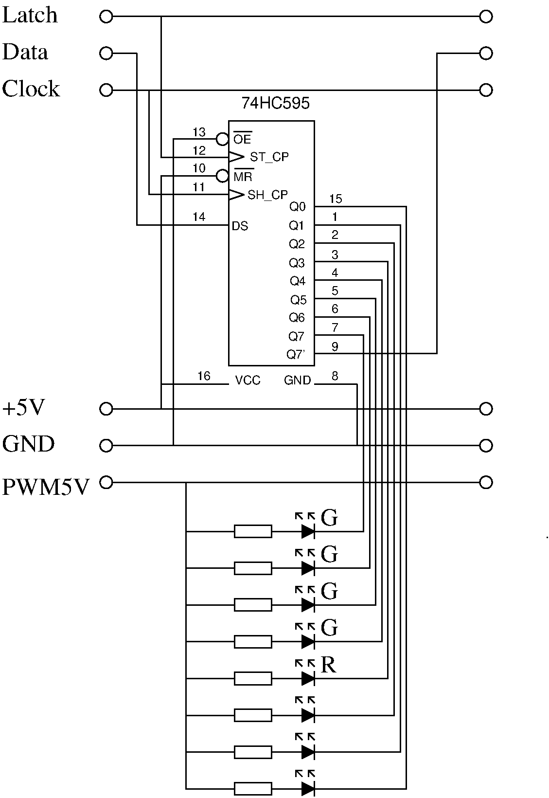

.. _clockworks_display_abakus:

Abakus Display
==============

:Date: 2017-08-18

.. contents::
   :local:
   :depth: 1

Intro
-----

The *Abakus Display* is very similar to a binary display.

Each digit is represented by 5 LEDs: 4 of them represent a value of 1,
the remaining LED represents a value of 5. The 5 LED should have a
recognizable position in the display, or a different color. Or not ---
for advanced geekness. I chose yellow LEDs for a value of 1 and red
LEDs for a value of 5.

If no LED is lit up, the overall value of the represented digit is 0.
If all LEDs are lit up, the overall value is 1*5 + 4*1 = 9. We can
thus represent digits ranging from 0 to 9, just convenient for a
decimal display.

I have not seen such a display elsewhere, but I would be very
surprised, should I be the first one to do that.

.. figure:: i_abakus_display_dark_h.jpg
   :width: 400 px

   **Abakus Display:** The image shows six columns of LEDs. Each
   column represents a digit. The red LED counts 5, the four yellow
   LEDs count 1 each. So the displayed time is 18:18:47 h.

   **Schematic:** The LEDs of the abakus display are connected to a
   shift register. Only one digit is shown, the others are chained as
   identical units. The LEDs are connected from ``+5 V`` power to the
   output pins. So the shift register really sinks the current through
   the LED. An output level of ``0`` or low will light up the LED.

Code Details
------------

The code has two parts

 #. a lookup table to translate a digit (say 7) into the correct bit
    pattern representing the digit (``$38``. see below).

 #. two words equivalent to ``emit`` and ``type``, which are used to
    acutally display a value.

Lookup Table
^^^^^^^^^^^^

The bit pattern representing a digit is determined by the connections
between specific LEDs and the corresponding output pin of the shift
register. For routing reasons, the LED representing the 5 is on output
pin 3: ``0000_1000`` or ``04`` is the bit pattern to represent 5. The
LEDs representing values of 1 are connected to output pins 4 to 7.
This corresponds to bit pattern ``10``, ``20``, ``40``, and ``80``.

The complete table is then

.. code-block:: forth

   create AbakusDigits
   $00 invert , \ 0
   $10 invert , \ 1
   $30 invert , \ 2
   $70 invert , \ 3
   $F0 invert , \ 4
   $08 invert , \ 5
   $18 invert , \ 6
   $38 invert , \ 7
   $78 invert , \ 8
   $F8 invert , \ 9

The values in this table must be adjusted according to the exact
hardware layout.
Please note the ``invert`` command. This is another hardware specific
twist: It is quite common to connect the LEDs from high (+5V, say) at
their anode, to low at the shift register output pin. The LED will
then light up, if the output pin is set to 0, i.e. low. The LED will
remain dark, if the output pin is set to 1. So in order to display a
value of 1, i.e. to light up the corresponding LED, we actually need
to write a 0 to that output pin.

emit / type
^^^^^^^^^^^

``emit.abakus`` and ``type.abakus`` transfer 1 or n bytes through the
shift registers and assert a latch pulse at last.

.. code-block:: forth

   \ transfer n digits
   : type.abakus ( xn-1 .. x0 n -- )
     0 ?do
       dup 0 #10 within if
       else
         drop 0                            \ map invalid to 0
       then
       AbakusDigits + @i  byte>sr
     loop
     sr_latch low sr_latch high
   ;
   \ transfer 1 digit from lookup table
   : emit.abakus ( n -- )
     1 type.abakus
   ;

Note that ``type.abakus`` is not building upon ``emit.abakus`` because
asserting the latch needs to be done after the last transfer only.
Otherwise all intermediate states of the shift register chain would
become visible --- who wants flickering LEDs?

Also note that ``type.abakus`` is verifying that the value on the
stack does not exceed its allowed range (0 .. 9). Invalid arguments
are silently replaced by zeros. This function is kind of *hardware
specific* and cannot be replaced by a general ``n>sr``, because it
refers to ``AbakusDigits`` explicitly.

Putting it all together
-----------------------

All we need to do is to put the desired digits onto the stack and send
them out: The first ones that go on the stack are hour-tens and
hour-ones, the first ones that are transferred are second-ones and
second-tens.

.. code-block:: forth

   #include shiftregister.fs
   #include abakus.fs

   : clock.display.abakus.time   ( -- )
     hour @  #10 /mod swap
     min  @  #10 /mod swap
     sec  @  #10 /mod swap
     6 type.abakus
   ;

   : job.sec  ...
     clock.display.abakus.time
   ;

   : init  ...
     +sr
   ;

   
The Code
--------

.. code-block:: forth
   :linenos:

   \ 2015-10-21 abakus_1.fs
   \
   \ Written in 2017 by Erich Wälde <erich.waelde@forth-ev.de>
   \
   \ To the extent possible under law, the author(s) have dedicated
   \ all copyright and related and neighboring rights to this software
   \ to the public domain worldwide. This software is distributed
   \ without any warranty.
   \
   \ You should have received a copy of the CC0 Public Domain
   \ Dedication along with this software. If not, see
   \ <http://creativecommons.org/publicdomain/zero/1.0/>.
   \
   \ #require shiftregister.fs
   
   \ we need a lookup table in sr.emit to map
   \ values (5) to led pattern ($08)
   create AbakusDigits
   $00  invert , \ 0
   $10  invert , \ 1
   $30  invert , \ 2
   $70  invert , \ 3
   $F0  invert , \ 4
   $08  invert , \ 5
   $18  invert , \ 6
   $38  invert , \ 7
   $78  invert , \ 8
   $F8  invert , \ 9
   
   \ transfer n digits
   : type.abakus ( xn-1 .. x0 n -- )
     0 ?do
       dup 0 #10 within if
       else
         drop 0 \ map invalid to zero?
       then
       AbakusDigits + @i   byte>sr
     loop
     sr_latch low sr_latch high
   ;
   \ transfer 1 digit from lookup table
   : emit.abakus ( n -- )
     1 type.abakus
   ;

