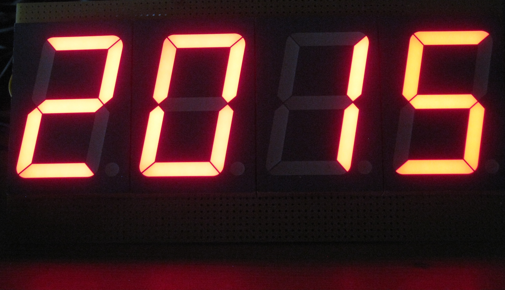
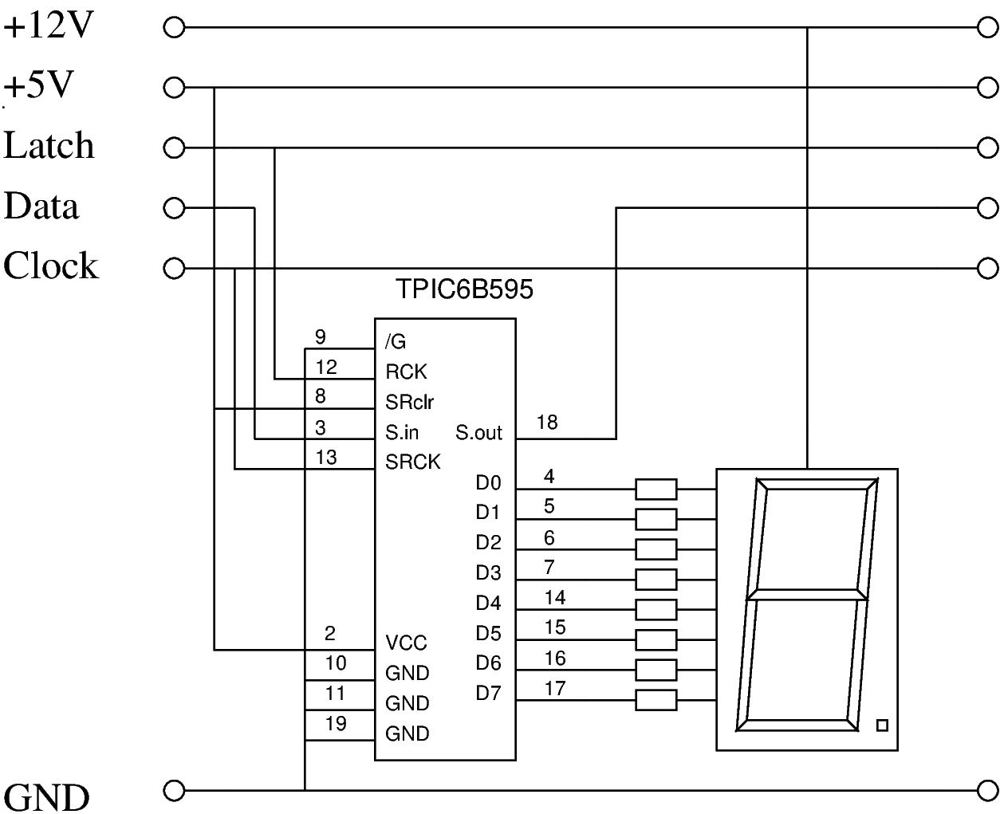

.. _clockworks_display_7segment_digits:

7-Segment Digits
================

:Date: 2017-08-20

.. contents::
   :local:
   :depth: 1

Intro
-----

This section describes a simple display with 4 7-segment LED digits.
The digits are fairly large (height: 70 mm). The LED segments have
forward voltage drops of 7.4 V, so a power rail of 12 V was provided.
In order to reduce components a specific shift register was chosen:
TPIC 6B595 --- it features FET stages to switch higher voltages
without a problem (hat tip to M.Koch for the pointer).

When connecting the LED segments to the output pins of the shift
register, I did not pay any attention other than makeing routing
simple. So afterwards I found out, which segment (A,B,...,G,DP) was
connected to which output pin (0,1,...,7).

As explained in the section about the abakus display, the code has two
parts, a) a lookup table to convert the desired value (0..9) into its
corresponding bit pattern, and b) a pair of functions similar to
``emit`` and ``type`` to actually send the bit pattern to the shift
register, making the digit appear on the display.

After creating the lookup table for the n+1th time, I added some
construction code to simplify writing the lookup table.

Code Details
------------

Lookup Table
^^^^^^^^^^^^

After adding the display to the controller board, I found out, which
segment corresponds to which bit in the shift register by sending
pattern like these:

.. code-block:: forth

   $01 invert >sr
   $02 invert >sr
   $04 invert >sr
   ...

The result is recorded into this piece of code:

.. code-block:: forth

    \ connected bit of each segment
    $01 constant _DP
    $02 constant _C
    $04 constant _D
    $08 constant _E
    $10 constant _G
    $20 constant _F
    $40 constant _A
    $80 constant _B
                

The actual bit pattern to create a desired digit in the display is
then contructed --- we let the controller and the compiler do the
tedious work, right?

.. code-block:: forth

   \ byte code of each digit
   create 7SegDigits
   0  _A or _B or _C or _D or _E or _F or        ,  \ 0
   0        _B or _C or                          ,  \ 1
   0  _A or _B or       _D or _E or       _G or  ,  \ 2
   0  _A or _B or _C or _D or             _G or  ,  \ 3
   0        _B or _C or             _F or _G or  ,  \ 4
   0  _A or       _C or _D or       _F or _G or  ,  \ 5
   0  _A or       _C or _D or _E or _F or _G or  ,  \ 6
   0  _A or _B or _C or                          ,  \ 7
   0  _A or _B or _C or _D or _E or _F or _G or  ,  \ 8
   0  _A or _B or _C or _D or       _F or _G or  ,  \ 9
   0  _A or _B or _C or       _E or _F or _G or  ,  \ A
   0              _C or _D or _E or _F or _G or  ,  \ b
   0                    _D or _E or       _G or  ,  \ c
   0        _B or _C or _D or _E or       _G or  ,  \ d
   0  _A or             _D or _E or _F or _G or  ,  \ E
   0  _A or                   _E or _F or _G or  ,  \ F

There are no ``invert`` commands here, because writing a ``1`` to a
position in the shift register switches on the FET stage, thus sinking
the current through the LED.

I have also added *digits* ``A`` to ``F``, just in case.

The leading ``0`` is added for visual symmetry: there is an ``or``
command after every ``_X`` segment name.

emit / type
^^^^^^^^^^^

``emit.7seg`` and ``type.7seg`` transfer 1 or n bytes through the
shift registers and assert a latch pulse eventually.
   
.. code-block:: forth

   \ transfer n digits, consult lookup table
   : type.7seg ( xn .. x1 n -- )
     0 ?do
       dup 0 #10 within if
       else
         drop 0 \ replace invalid by zero --- questionable! fixme:
       then
       7SegDigits + @i  byte>sr
     loop
     sr_latch low sr_latch high
   ;
   
   \ transfer 1 digit
   : emit.7sec ( n -- )
     1 type.7seg
   ;

Note that ``type.7seg`` is not building upon ``emit.7seg`` because
asserting the latch needs to be done after the last transfer only.
Otherwise all intermediate states of the shift register chain would
become visible --- who wants flickering LEDs?

Also note that ``type.7seg`` is verifying that the value on the
stack does not exceed its allowed range (0 .. 9). Invalid arguments
are silently replaced by zeros. This function is kind of *hardware
specific* and cannot be replaced by a general ``n>sr``. because it
refers to ``7SegDigits`` explicitly. This could be buried in another
level of indirection, but I did not see that need.

Putting it all together
-----------------------

All we need to do is to put the desired digits onto the stack and send
them out: The first ones that go on the stack are hour-tens and
hour-ones, the first ones that are transferred are minute-ones and
minute-tens --- we have 4 digits only on the display.

.. code-block:: forth

   #include shiftregister.fs
   #include 7seg_1.fs

   : clock.display.7segments1.time   ( -- )
     hour @ #10 /mod swap
     min  @ #10 /mod swap
     4 type.7seg
   ;

   : job.min  ...
     clock.display.7segments1.time
   ;

   : init  ...
     +sr
   ;

The Code
--------

.. code-block:: forth
   :linenos:

   \ 2017-07-09 7seg_1.fs
   \
   \ Written in 2017 by Erich Wälde <erich.waelde@forth-ev.de>
   \
   \ To the extent possible under law, the author(s) have dedicated
   \ all copyright and related and neighboring rights to this software
   \ to the public domain worldwide. This software is distributed
   \ without any warranty.
   \
   \ You should have received a copy of the CC0 Public Domain
   \ Dedication along with this software. If not, see
   \ <http://creativecommons.org/publicdomain/zero/1.0/>.
   \
   \ need ewlib/shiftregister.fs
   \
   \ words
   \     _A _B _C ... _G _DP               \ segment names, CUSTOMIZE!
   \     7SegDigits                        \ table in flash
   \     type.7seg ( xn .. x1 n -- )
   \     emit.7sec ( n -- )
   \     
   \ Pinout Kingbright 7seg displays
   \ 
   \     top, display side 10 .. 6
   \     :  10...6
   \     : +---a---+
   \     : |       |
   \     : f       b
   \     : |       |
   \     : +---g---+
   \     : |       |
   \     : e       c
   \     : |       |
   \     : +---d---+  DP
   \     :   1...5
   \     bottom, display side 1 .. 5
   \ 
   \     - 1 :: e
   \     - 2 :: d
   \     - 3 :: +
   \     - 4 :: c
   \     - 5 :: DP
   \     - 6 :: b
   \     - 7 :: a
   \     - 8 :: +
   \     - 9 :: f
   \     - 10 :: g
   
   \ connected bit of each segment
   $01 constant _DP
   $02 constant _C
   $04 constant _D
   $08 constant _E
   $10 constant _G
   $20 constant _F
   $40 constant _A
   $80 constant _B
   
   \ byte code of each digit
   create 7SegDigits
   0 _A or _B or _C or _D or _E or _F or       , \ 0
   0       _B or _C or                         , \ 1
   0 _A or _B or       _D or _E or       _G or , \ 2
   0 _A or _B or _C or _D or             _G or , \ 3
   0       _B or _C or             _F or _G or , \ 4
   0 _A or       _C or _D or       _F or _G or , \ 5
   0 _A or       _C or _D or _E or _F or _G or , \ 6
   0 _A or _B or _C or                         , \ 7
   0 _A or _B or _C or _D or _E or _F or _G or , \ 8
   0 _A or _B or _C or _D or       _F or _G or , \ 9
   0 _A or _B or _C or       _E or _F or _G or , \ A
   0             _C or _D or _E or _F or _G or , \ b
   0                   _D or _E or       _G or , \ c
   0       _B or _C or _D or _E or       _G or , \ d
   0 _A or             _D or _E or _F or _G or , \ E
   0 _A or                   _E or _F or _G or , \ F
   
   \ transfer n digits, consult lookup table
   : type.7seg ( xn .. x1 n -- )
     0 ?do
       dup 0 #10 within if
       else
         drop 0 \ replace invalid by zero --- questionable! fixme:
       then
       7SegDigits + @i  byte>sr
     loop
     sr_latch low sr_latch high
   ;
   
   \ transfer 1 digit
   : emit.7sec ( n -- )
     1 type.7seg
   ;
