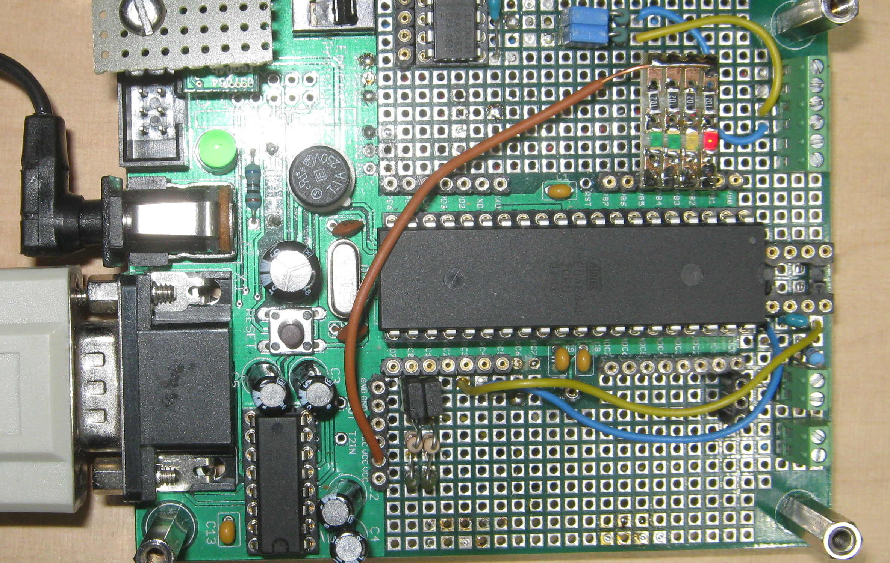

.. _clockworks_main_fairly_minimal:

Model 1: The Fairly Minimal Clock
=================================

:Date: 2017-08-13

.. contents::
   :local:
   :depth: 1

Design Decisions
----------------

 * 32 ticks/sec, generated from main crystal (11.0592 MHz)
 * timeup clock with simple counters, no structures, no timezone
 * display on serial, on demand ``.d``
 * **optional:** uptime counter
 * **optional:** led.1 blinking 1/sec
 * fixed start time (2017-01-01 00:00:00)
 * multitasker

Description
-----------

The code included below is a complete, working example, tested on an
atmega644p controller. The initial list of includes can be shortened
somewhat, it just makes debugging and working simpler. The syntax for
the includes is such that ``amforth-shell.py`` will upload the
programm and resolve all ``#include file`` directives.

   **Model 1** is just living inside this eval board. There is no
   display other than the serial connection!

The pin definitions are directly related to the electronic schematics
of your system. For this fairly minimal clock only 4 status LEDs are
defined, which may be absent alltogether.

..
   This block is a comment, they say.

   I wonder, how it's rendered. --- Not visible at all :-)

The includes after that correspond to what has been detailed in the
*Ingredients* section before (:ref:`clockworks_ingredients`).

``timeup_v0.0.fs`` implements the clock counters and function
``timeup``, which advances all counters of the clock by one second
including counter overflows.

``uptime`` is a variable to count the uptime of the system in
seconds. It is optional, however, it should illustrate using the
periodic jobs to get some work done.

``clock_tick1_main.fs`` implements the clock ticks driven by the
main crystal and generated as timer/counter1 overflow interrupts.

The functions ``clock.set``, ``clock.get``, and ``clock.show`` are
there to conveniently set the clock and show date and time. No
timezone has been implemented. The clock will run whatever time is
set.

``multitask.frt`` provides the mechanics to have the clock run in
the background and the command loop still available at the serial
connection.

After all that, the periodic jobs are defined. Only two things are
done: ``job.sec`` will increment the ``uptime`` counter, and
``job.month`` will update the length of the month in the Limits
array.

The function ``run-masterclock`` implements the background job. It
will run as often as possible. It will check, whether a tick is over
and call ``job.tick`` if this is the case. It will also check if half
a second or a full second has passed, and light up one LED
accordingly. If a full second has passed, then ``timeup`` is called to
advance the clock counters, and ``jobCount`` is set, such that in the
rounds through this loop to come, all needed periodic jobs are called,
one job per loop.

``run-masterclock`` is wrapped as a ``task:``, ``start-masterclock``
will start the background task. The function ``starttasker`` is
starting all tasks, thereby converting the command loop into a task as
well. Finally the multitasker is activated.

``init`` is to set up everything in working conditions. ``run`` will
start the whole show on the command prompt. In order to make the
program start automatically at powerup, ``run-turnkey`` is defined and
can be registered as ``turnkey``.

The last function, ``.d`` is our display. It is to be called on the
command loop via serial connection. Similarly the clock can be set
now, it should run with an error of a few seconds per day.

.. code-block:: none

   > .d
   2451 s  2017-01-01_00:40:51 13  12909
    ok
   > #2017 8 13 18 41 30 clock.set .d
   2525 s  2017-08-13_18:41:30 3  15299
    ok
   > .d
   2530 s  2017-08-13_18:41:35 26  15450
    ok
   >

The Code
--------

.. code-block:: forth
   :linenos:
   :emphasize-lines: 16-18

   \ 2017-08-13  main-01-fairly-minimal.fs
   \
   \ Written in 2017 by Erich Wälde <erich.waelde@forth-ev.de>
   \
   \ To the extent possible under law, the author(s) have dedicated
   \ all copyright and related and neighboring rights to this software
   \ to the public domain worldwide. This software is distributed
   \ without any warranty.
   \
   \ You should have received a copy of the CC0 Public Domain
   \ Dedication along with this software. If not, see
   \ <http://creativecommons.org/publicdomain/zero/1.0/>.
   \
   \ include syntax for upload with amforth-shell.py
   \
   \     11.059200 MHz main crystal
   \     timer/counter1
   \     32 ticks/second
   \
   #include builds.frt
   #include erase.frt
   #include dot-base.frt
   #include imove.frt
   #include bitnames.frt
   #include marker.frt
   #include environment-q.frt
   #include dot-res.frt
   #include avr-values.frt
   #include is.frt
   #include dumper.frt
   #include interrupts.frt
   \ these definitions are resolved by amforth-shell.py as needed
   \ include atmega644p.fs

   #include flags.frt
   #include 2variable.frt
   #include 2constant.frt
   #include 2-fetch.frt
   #include 2-store.frt
   #include m-star-slash.frt
   #include quotations.frt
   #include avr-defers.frt
   #include defers.frt

   marker --start--

   \ --- ports, pins, masks

   PORTB 2 portpin: led.0
   PORTB 3 portpin: led.1
   PORTB 4 portpin: led.2
   PORTB 5 portpin: led.3

   \ --- famous includes and other words
   : ms   ( n -- )       0 ?do pause 1ms loop ;
   : u0.r ( u n -- )     >r 0 <# r> 0 ?do # loop #> type ;
   : odd?  ( x -- t/f )  $0001 and 0= 0= ;
   : even? ( x -- t/f )  $0001 and 0= ;

   \ --- driver: status leds
   #include leds.fs

   \ --- master clock
   \ --- timeup
   #include timeup_v0.0.fs
                                           \ tu.counts -- fields available as:
                                           \   tick sec min hour day month year
                                           \ last_day_of_month ( year month -- last_day )
                                           \ timeup.init
                                           \ timeup
                                           \ tu.upd.limits ( Y m -- )

   \ --- uptime
   2variable uptime
   : .uptime  ( -- )  uptime 2@  decimal ud. [char] s emit ;
   : ++uptime ( -- )  1.  uptime 2@  d+  uptime 2! ;

   \ --- timer1 clock tick
   \ 32 ticks/sec
   \ timer_1_ overflow
   \ clock source main crystal/256
   #include clock_tick1_main.fs
                                           \ +ticks
                                           \ tick.over?  ( -- t/f )
                                           \ tick.over!
                                           \ half.second.over?  ( -- 0|1|2 )
   : clock.set ( Y m d H M S -- )
     sec ! min ! hour !
     1- day !
     over over
     1- month ! year !
     ( Y m ) tu.upd.limits
   ;
   : clock.get ( -- S M H d m Y )
     sec @ min @ hour @
     day @ 1+ month @ 1+ year @
   ;
   : clock.dot ( S M H d m Y -- )
     #4 u0.r [char] - emit #2 u0.r [char] - emit #2 u0.r  [char] _  emit
     #2 u0.r [char] : emit #2 u0.r [char] : emit #2 u0.r
   ;
   : clock.show ( -- )
     clock.get
     clock.dot
   ;
   \ --- multitasker
   #include multitask.frt
                                           \ activate ( tid -- )
                                           \ task-sleep ( tid -- )
                                           \ task-awake ( tid -- )
                                           \ task: ( rs-size ds-size -- tid )
                                           \ onlytask ( -- )
                                           \ alsotask ( tid -- )
                                           \ single ( -- )
                                           \ multi ( -- )
                                           \ tasks ( -- )
   : +tasks  multi ;
   : -tasks  single ;

   \ --- timeup jobs ---------------------------
   : job.tick
   ;
   : job.sec
     ++uptime
   ;
   : job.min
   ;
   : job.hour  ;
   : job.day   ;
   : job.month
     \ update length of month in tu.limits
     year @  month @ 1+  tu.upd.limits
   ;
   : job.year  ;

   create Jobs
     ' job.tick ,
     ' job.sec , ' job.min ,   ' job.hour ,
     ' job.day , ' job.month , ' job.year ,

   variable jobCount
   : jobCount++
     jobCount @
     6 < if
       1 jobCount +!
     then
   ;

   \ --- task 2 --------------------------------
   : run-masterclock
     ['] tx-poll to emit \ add emit to run-masterclock
     begin

       tick.over? if
         tick.over!
         1 tick +!
         job.tick
       then

       half.second.over?
       dup 0<> if
         dup odd? if       \ half second
           led.1 off
         else              \ second
           led.1 on
           timeup
           0 tick !
           1 jobCount !
         then
       then
       drop

       \ run one job per loop, not all at once
       jobCount @
       bv tu.flags fset?
       if
         jobCount @ dup
         Jobs + @i execute
         bv tu.flags fclr
       then
       jobCount++

       pause
     again
   ;
   $40 $40 0 task: task-masterclock \ create task space
   : start-masterclock
     task-masterclock tib>tcb
     activate
     \ words after this line are run in new task
     run-masterclock
   ;
   : starttasker
     task-masterclock task-init            \ create TCB in RAM
     start-masterclock                     \ activate tasks job

     onlytask                              \ make cmd loop task-1
     task-masterclock tib>tcb alsotask     \ start task-2
     multi                                 \ activate multitasking
   ;

   \ --- main ----------------------------------
   : init
     +leds leds-intro
     #2017 1 1 0 0 0 clock.set
     0. uptime 2!
     +ticks
     timeup.init
     \  cd.localtime
   ;
   : run
     init
     starttasker
   ;
   : run-turnkey
     applturnkey
     init
     starttasker
   ;
   \ ' run-turnkey to turnkey

   : .d ( -- )
     decimal
     .uptime         space space
     clock.show      space
     tick            @ . space
     ct.ticks.follow @ .
     cr
   ;
